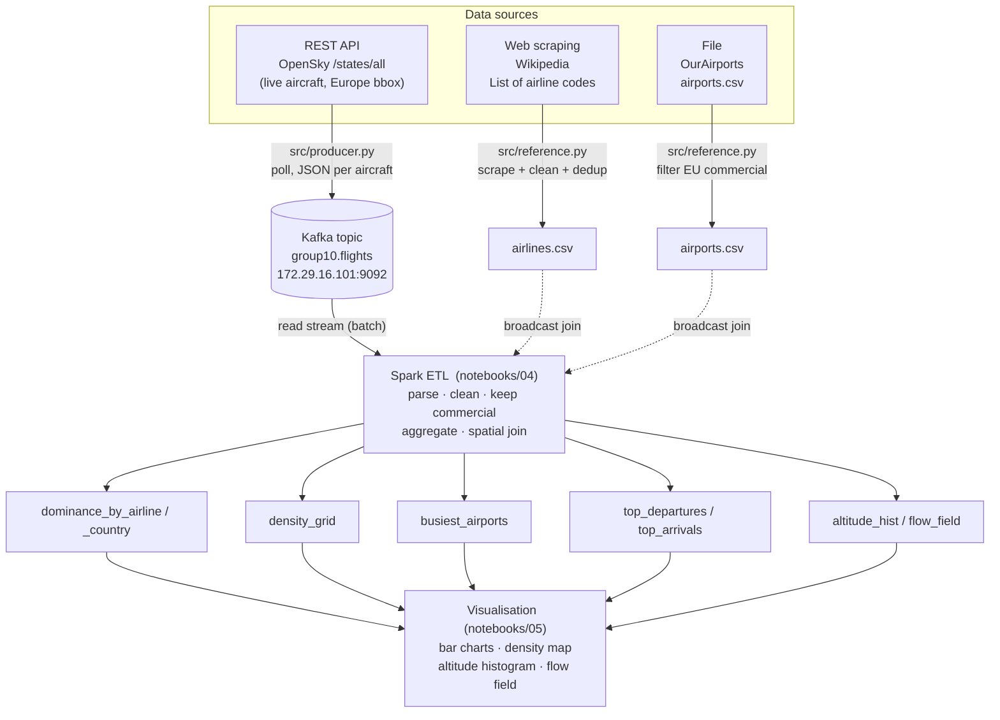

# Data Flow — Analysis of European Commercial Airspace

End-to-end flow of the project: **3 data sources → ingestion → Kafka → Spark ETL → stored results → visualisation.**

## Diagram

Only the **live OpenSky feed** flows through Kafka (the streaming source). The two
reference sources are static, so they are prepared once into CSV files and
**broadcast-joined** inside Spark — Kafka is the right tool for the live stream,
not for static lookup tables.

## Data sources
| # | Type | Source | Obtained via |
|---|------|--------|--------------|
| 1 | REST API | OpenSky Network `/api/states/all` (Europe bbox) | `requests` polling in `src/producer.py` |
| 2 | Web scraping | Wikipedia "List of airline codes" | `BeautifulSoup` in `src/reference.py` |
| 3 | File | OurAirports `airports.csv` | `pandas.read_csv` in `src/reference.py` |

## Transformations
| Stage | Where | What |
|-------|-------|------|
| Ingest flights | `src/producer.py` | poll OpenSky, map state vectors → JSON, publish one message per aircraft to Kafka |
| Prepare references | `src/reference.py` | scrape airline codes (dedup ICAO); filter airports to EU + scheduled + large/medium |
| Read & parse | Spark (04) | batch-read Kafka, parse JSON to typed columns, cache |
| Clean | Spark (04) | drop on-ground / empty callsign; derive airline ICAO; drop altitude outliers |
| Commercial filter | Spark (04) | inner broadcast-join flights ↔ airline codes (private/military drop out) |
| Aggregate | Spark (04) | dominance counts; density grid; nearest-airport spatial join (haversine); climb/descent split; altitude bins; heading flow field |

## Results (stored to `data/processed/`, parquet)
| File | Question |
|------|----------|
| `dominance_by_airline`, `dominance_by_country` | Q1 — who dominates |
| `density_grid` | Q2 — busiest corridors |
| `busiest_airports` | Q3 — busiest airports |
| `top_departures`, `top_arrivals` | Q4a — departures vs arrivals |
| `altitude_hist` | extra — altitude / flight levels |
| `flow_field` | extra — dominant headings |